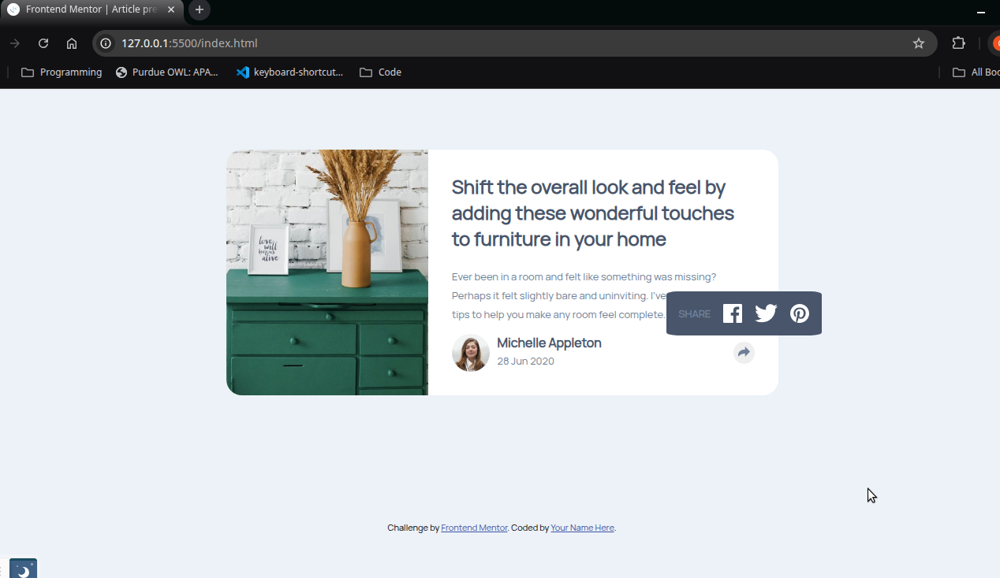

# Frontend Mentor - Article preview component solution

This is a solution to the [Article preview component challenge on Frontend Mentor](https://www.frontendmentor.io/challenges/article-preview-component-dYBN_pYFT). Frontend Mentor challenges help you improve your coding skills by building realistic projects. 

## Table of contents

- [Overview](#overview)
  - [The challenge](#the-challenge)
  - [Screenshot](#screenshot)
  - [Links](#links)
  - [Built with](#built-with)
  - [What I learned](#what-i-learned)
  - [Continued development](#continued-development)
- [Author](#author)

### The challenge

Users should be able to:

- View the optimal layout for the component depending on their device's screen size
- See the social media share links when they click the share icon

### Screenshot



### Links

- Solution URL: [Add solution URL here](https://your-solution-url.com)
- Live Site URL: [Add live site URL here](https://your-live-site-url.com)

## My process

### Built with

- Semantic HTML5 markup
- CSS custom properties
- Flexbox

### What I learned

I learned a bit about events and how they connect with the elements to make things work.

```css
I also learned a bit on how to create a popup from w3Schools How To section. Might have to do further research into animation.

.menu::after{
    position: absolute;
}

.menu.show {
    visibility: visible;
    -webkit-animation: fadeIn 1s;
    animation: fadeIn 1s
  }
  
  /* Add animation (fade in the popup) */
  @-webkit-keyframes fadeIn {
    from {opacity: 0;}
    to {opacity: 1;}
  }
  
  @keyframes fadeIn {
    from {opacity: 0;}
    to {opacity:1 ;}
  }
```


### Continued development

I'm still not fully understanding how to modify certain elements to fit their container. I couldn't get the 
right changes to the links menu for the mobile active state.


## Author

- Frontend Mentor - [@chrislloyd876](https://www.frontendmentor.io/profile/chrislloyd876)


